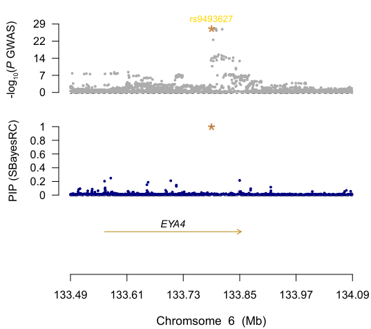

#### 1、GWFM
###### 1. imputed the summary data
```
#! /bin/bash
gctb="~/software/gctb"
ldref="~/GCTB_ref/ukbEUR_Imputed"
gwas="~/GWAS.txt"
out_block="~/gwfm/impu_block/GWAS_impu"
out_impu="GWAS.imputed"

# step1: impute summary data
for i in {1..591}; do
  $gctb --ldm-eigen ${ldref} --gwas-summary ${gwas} --impute-summary --block $i --thread 10 --out ${out_block}
done

# step2: combined block file to one 
$gctb --gwas-summary GWAS_impu --merge-block-gwas-summary --out ${out_impu} 
```
###### 2. Running GWFM
```
annofile="~/GCTB_ref/annot_baseline2.2.txt"
gwas_impu="GWAS.imputed.ma"

outprx=$(basename -- ${gwas_impu} ".imputed.ma")

# step1: GWFM
$gctb --sbayes RC --ldm-eigen $ldref --annot $annofile --gwas-summary $gwas_impu --n-dist-aut --write-mcmc-bin --thread 10 --out ${outprx}_SbayesRC

# step2: Calculate credible sets
# 1: calculate pairwise ld r2 > 0.5, only need run once
# $gctb --get-ld --ldm-eigen ${ldref} --rsq 0.5 --out LD_rsq05 --thread 10
# 2: use ldfile calculate credible sets
ldfile="~/GCTB_ref/ukbEUR_Imputed/LD_rsq05.ld.txt"

$gctb --cs --ld-file ${ldfile} --pip 0.9 --mcmc-samples $${outprx}_SbayesRC --out ${outprx}_SbayesRC_finemapping
```


#### 可视化结果
###### 单个变异
```
source("~/script/plot_GWFM.r")
gwas="~/GWAS_addchr.gz"
gwfm="~/gwfm/GWAS_SbayesRC.snpRes"
genelist="~/script/plot_smr/glist_hg19_refseq.txt"

snp = "rs1126809"

PData = ReadPvalueFromFiles(gwas=gwas, gwfm=gwfm, glist=genelist, windowsize=300000, highlight=snp)
pdf("rs1126809_test.pdf",width = 8,height = 8)
MultiPvalueLocusPlot(data=PData)
dev.off()
```
###### 多个变异循环
```
source("~/script/plot_GWFM.r")
gwas="~/GWAS_addchr.gz"
gwfm="~/gwfm/GWAS_SbayesRC.snpRes"
genelist="~/script/plot_smr/glist_hg19_refseq.txt"

SNP = fread("~/GWAS_SbayesRC_finemapping.gcs")
causal = SNP[PIP > 0.9, ][ ,SNP]

causal = data.table(
    rsID = c("rs62623452", "rs13147559", "rs2242416", "rs9493627", "rs35094336", "rs143282422", "rs1126809",
            "rs35887622", "rs2289702", "rs1805005", "rs118174674", "rs61734651", "rs45598239", "rs36062310"),
    CHR = c("2", "4", "6", "6", "8", "10", "11", "13", "15", "16", "18", "20", "21", "22")
)

dir_path = "~/gwfm/plot"
dir.create(dir_path, showWarnings = FALSE)

for (i in seq_len(nrow(causal))) {
    snp = causal[i]$rsID
    chr = causal[i]$CHR
    print(paste("processing: ", snp))
    outprex = file.path(dir_path, sprintf("chr%s_%s_gwfm.pdf", chr, snp))
    PData = ReadPvalueFromFiles(gwas=gwas, gwfm=gwfm, glist=genelist, windowsize=300000, highlight=snp)
    pdf(outprex,width = 8,height = 8)
    MultiPvalueLocusPlot(data=PData)
    dev.off()
}
```
###### 结果示例
