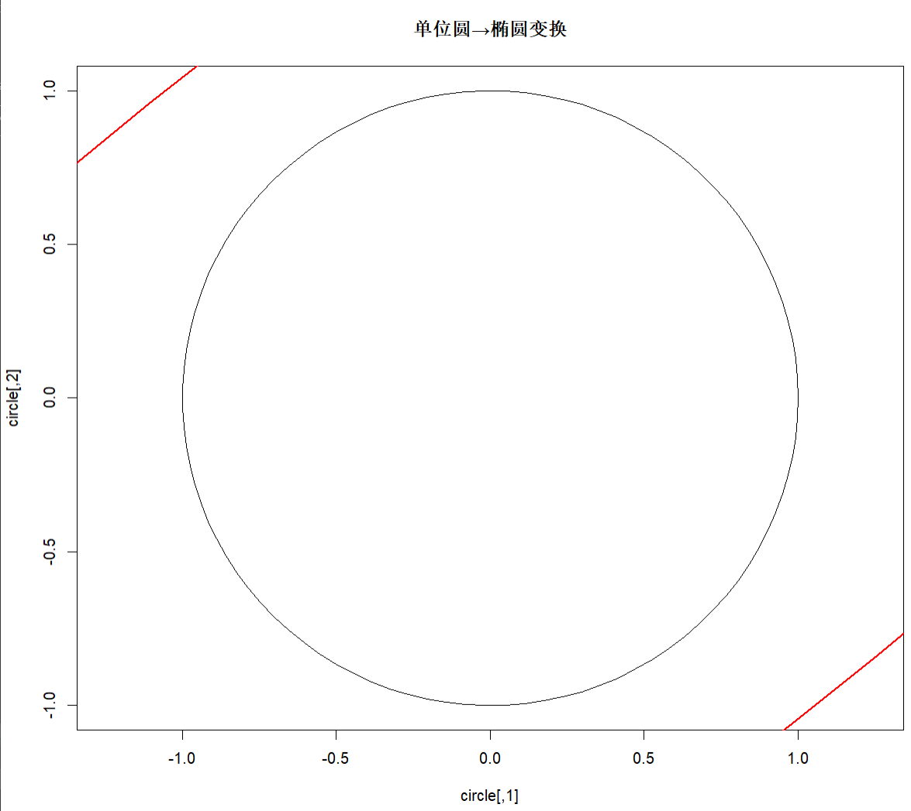

Some scripts and skills for statistical genetics analysis during the PhD candidate (mainly related to `GWAS`)

## GWAS 效应量标准化（Scaling）

### 背景

GWAS 输出的边际效应 `b` 和标准误 `se` 通常来自未标准化的基因型（0/1/2），
且不同研究中的表型方差不可比。
而 SBayesR、LDpred、PRS-CS 等 summary-based Bayesian 方法默认：

- 基因型已标准化：Var(g) = 1
- 表型已标准化：Var(y) = 1

因此，在 post-GWAS 分析中，需要先对 GWAS 效应量进行尺度统一。

### 标准化效应量公式

给定 GWAS summary statistics：

- `b`：边际效应估计
- `se`：标准误
- `n`：样本量
- `p`：效应等位基因频率
- `z = b / se`

标准化后的 SNP 效应量定义为：

$$
\beta_{\text{scaled}} = \frac{z}{\sqrt{2p(1-p)(n + z^2)}}
$$

该效应量满足：

- Var(g) = 1
- Var(y) = 1

可直接用于 summary-based Bayesian / post-GWAS 模型。

### 与 SBayesR 内部 scaling 的关系

SBayesR 在内部会对输入的 `b` 和 `se` 进行如下缩放：

$$
\beta_{\text{SBayesR}} = b \cdot \frac{1}{\sqrt{n \cdot se^2 + b^2}}
$$

当 GWAS 使用标准化基因型时，
上述公式与 $\beta_{\text{scaled}}$ 在数学上是等价的
（此时 $2p(1-p)$ 被吸收到基因型标准化中）。

### 注意事项

如果输入的效应量已经是 $\beta_{\text{scaled}}$，
又使用原始 SBayesR（未关闭其内部 scaling），
则效应量会被重复缩放，导致系统性偏差。

### 实践建议

| 使用场景 | 推荐做法 |
|--------|--------|
| 使用原版 SBayesR / SBayesRC | 使用原始 GWAS 的 `b` 和 `se` |
| 自定义 post-GWAS / meta / beta-imputation | 使用 $\beta_{\text{scaled}}$ |
| 向 Bayesian 模型输入已标准化效应 | 关闭其内部 scaling |

### 一句话总结

该公式将 GWAS 的 z-score 转换为
在 Var(g)=1、Var(y)=1 条件下的等价 SNP 效应量，
是 summary-based Bayesian 遗传分析的统一工作尺度。

---
## 特征值分解 (Eigen Decomposition) 详解
#### 1.基本概念
1.1 数学定义
对于实对称矩阵 $R$（如LD矩阵），存在特征值分解：

$$
R = U \Lambda U^T
$$
 
其中：
- $U$：特征向量矩阵（正交矩阵）
- $\Lambda$：特征值对角矩阵
- $U^T$：$U$ 的转置

1.2 各成分解释

| 符号 | 名称 | 维度 | 性质 |
|:---:|:---:|:---:|:---:|
| R | 原始矩阵 | m × m | 对称正定 |
| U | 特征向量矩阵 | m × m | 正交矩阵：UᵀU = I |
| Λ | 特征值矩阵 | m × m | 对角矩阵：diag(λ₁, λ₂, …, λₘ) |
| λᵢ | 特征值 | 标量 | λ₁ ≥ λ₂ ≥ … ≥ λₘ > 0 |


#### 2.几何意义
2.1 变换三部曲

$$
R \times 向量 = U \times \Lambda \times U^T \times 向量
$$

1. $U^T \times \text{向量}$：旋转到特征向量坐标系

2. $\Lambda \times (\text{结果})$：沿新坐标轴缩放

3. $U \times (\text{结果})$：旋转回原始坐标系

2.2 可视化理解
```
# 单位圆经R变换成椭圆
theta <- seq(0, 2*pi, length=100)
circle <- cbind(cos(theta), sin(theta))

# 假设 R = [[4, 2], [2, 3]]
R <- matrix(c(4, 2, 2, 3), nrow=2)
ellipse <- circle %*% R

# 绘图展示
plot(circle, type="l", asp=1, main="单位圆→椭圆变换")
lines(ellipse, col="red", lwd=2)
```


#### 3. R语言实现
3.1 基础分解
```
# 生成对称矩阵
set.seed(123)
m <- 5
R <- matrix(runif(m^2, 0.1, 0.9), m, m)
R <- (R + t(R)) / 2  # 强制对称
diag(R) <- 1         # 对角线设为1（LD矩阵）

# 特征值分解
eig <- eigen(R, symmetric = TRUE)

# 提取结果
U <- eig$vectors      # 特征向量矩阵
values <- eig$values  # 特征值向量
Lambda <- diag(values) # 特征值对角矩阵

# 验证分解正确性
R_recon <- U %*% Lambda %*% t(U)
all.equal(R, R_recon, tolerance = 1e-10)  # 应返回TRUE
```
3.2 降维近似（低秩近似）
```
# 只保留前k个主成分
k <- 2  # 保留的主成分数量

# 选择前k个特征值和特征向量
U_k <- U[, 1:k]                # m × k
values_k <- values[1:k]        # 长度k
Lambda_k <- diag(values_k)     # k × k

# 低秩近似重建
R_approx <- U_k %*% Lambda_k %*% t(U_k)  # m × m，但秩为k
```
#### 4. 遗传学中的应用
4.1 LD矩阵分析
```
# LD矩阵的特征值分解
analyze_ld_structure <- function(R, eigen_ratio = 0.95) {
    eig <- eigen(R, symmetric = TRUE)
    values <- eig$values
    U <- eig$vectors
    
    # 计算累积方差解释比例
    total_var <- sum(values)
    cum_prop <- cumsum(values) / total_var
    
    # 确定保留的主成分数
    k <- which(cum_prop >= eigen_ratio)[1]
    if (is.na(k)) k <- length(values)
    
    # 输出结果
    cat("总方差:", total_var, "\n")
    cat("特征值分布:\n")
    print(head(values, 10))
    cat("\n保留主成分数:", k, "\n")
    cat("解释方差比例:", cum_prop[k], "\n")
    
    return(list(U = U, values = values, k = k))
}
```
4.2 高效计算技巧
```
# 技巧1：计算 R × beta（避免显式构造R）
compute_R_times_beta <- function(beta, U, values) {
    # beta: m×1向量
    # U: m×k特征向量矩阵
    # values: k个特征值
    
    # 高效计算：R × beta = U × diag(values) × U^T × beta
    tmp <- crossprod(U, beta)  # = U^T × beta，k×1矩阵
    tmp <- tmp[, 1] * values   # 转换为向量并乘以特征值
    result <- U %*% tmp        # = U × (diag(values) × U^T × beta)
    
    return(result)
}

# 技巧2：计算 R^{-1} × beta（避免求逆）
compute_R_inv_times_beta <- function(beta, U, values, epsilon = 1e-8) {
    # 过滤小特征值，避免数值问题
    keep <- values > epsilon
    U_filtered <- U[, keep]
    values_filtered <- values[keep]
    
    # 计算：R^{-1} × beta = U × diag(1/values) × U^T × beta
    tmp <- crossprod(U_filtered, beta)
    tmp <- tmp[, 1] / values_filtered  # 关键：除以特征值！
    result <- U_filtered %*% tmp
    
    return(result)
}
```
#### 5. 数值稳定性处理
5.1 正定性校正
```
# 确保矩阵正定
ensure_positive_definite <- function(R, eig_tol = 1e-8) {
    eig <- eigen(R, symmetric = TRUE)
    values <- eig$values
    U <- eig$vectors
    
    # 检查最小特征值
    min_eig <- min(values)
    if (min_eig < eig_tol) {
        cat(sprintf("警告：最小特征值 = %.2e，进行校正\n", min_eig))
        
        # 方法1：添加岭惩罚
        lambda <- abs(min_eig) + 1e-6
        R_corrected <- R + diag(lambda, nrow(R))
        
        # 重新标准化（如果是相关矩阵）
        s <- 1 / sqrt(diag(R_corrected))
        R_corrected <- diag(s) %*% R_corrected %*% diag(s)
        
        return(R_corrected)
    }
    
    return(R)
}
```
5.2 `nearPD` 校正
```
# 使用Matrix包的nearPD函数
if (!require(Matrix)) install.packages("Matrix")
library(Matrix)

correct_with_nearpd <- function(R) {
    # 寻找最近的正定矩阵
    R_pd <- nearPD(R, 
                   corr = TRUE,      # 保持相关矩阵结构
                   keepDiag = TRUE,  # 保持对角线
                   do2eigen = TRUE,  # 确保正定
                   eig.tol = 1e-6,   # 特征值容忍度
                   conv.tol = 1e-7,  # 收敛容忍度
                   maxit = 100)      # 最大迭代次数
    
    return(as.matrix(R_pd$mat))
}
```
#### 7. 总结表格
| 操作 | 公式 | R 代码实现 |
|:---:|:---:|:---|
| 特征值分解 | $R = U \Lambda U^\top$ | `eig <- eigen(R, symmetric = TRUE)` |
| 重建矩阵 | $R_{\text{recon}} = U \Lambda U^\top$ | `U %*% diag(values) %*% t(U)` |
| 低秩近似 | $R \approx U_k \Lambda_k U_k^\top$ | `U[, 1:k] %*% diag(values[1:k]) %*% t(U[, 1:k])` |
| 计算 $R b$ | $U\big(\Lambda (U^\top b)\big)$ | `U %*% (crossprod(U, b)[, 1] * values)` |
| 计算 $R^{-1} b$ | $U\big(\Lambda^{-1} (U^\top b)\big)$ | `U %*% (crossprod(U, b)[, 1] / values)` |
| 特征值过滤 | 保留 $\lambda_i > \epsilon$ | `keep <- values > epsilon` |

